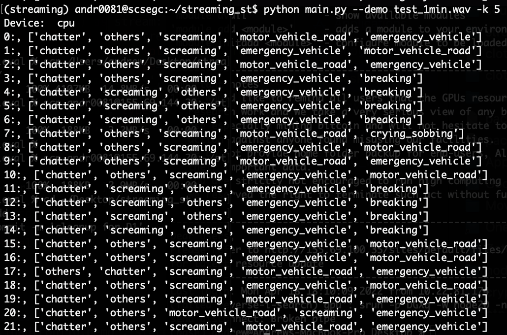

## Description
`main.py` is an example script to get predictions from the `StreamingModel` class. Please build your own streaming wrapper around this model.

The function to call for every 3 sec wav audio is `model.predict_3sec(wav)`. Refer to `main.py` for more details.

### Update 07/07/22
Now also creates xml and json captions (same captions as the srt, just different format).   
You can now specify your caption prefix (eg 'M1:') and model to generate the captions in config.   
Example command `python main.py --demo test_1min.wav -k 5 -p M1: -m M1`   

### Update 30/6/22
Now creates srt file for the audio. Load the audio-srt pair using VLC player.   
Now also allows folder input for `-d`. Ignore other files that are not '.mp3', '.mp4' and '.wav'.  

## Cloning the conda environment

1. `conda env create -f environment.yml`  
2. `conda install pytorch torchvision torchaudio cpuonly -c pytorch`  
3. `conda activate streaming`  

## Dockerfile

1. docker build .
2. docker run -i -t -p <your_port>:5050 <image_id>

## How to use with your streaming wrapper
`main.py` is an example script for deployment. Note that you have to create your own input streaming wrapper around the model and use its function as you see fit.

The general logic for using the model is this:  

1. Initialize the model globally by `model = StreamingModel(config)`
2. Everytime a new 3 second window comes in, call the function using `model.predict_3sec(wav)`

## Configuration
Most of the values in `config.py` can be kept default, unless you want to tweak the parameters. Note that the `argparser` in `main.py` does not parse for all keywords in `config.py`

```
feature_type: logmelspec
num_bins: 128
gpu: False
sample_rate: 16000
threshold: 0.9
n_fft: 928                                          #formula: (2560*sample_rate)//44100
hop_length: 251                                     #formula: (694*sample_rate)//44100
n_mels: 128
fmin: 20
fmax: 8000
num_frames: 192                                     #formula: int(np.ceil(sample_rate*3/hop_length)) used in resizing spectrogram

# model_loading 
model_path: model/16.0k/model_logmelspec_012
channel_means_path: data/statistics/16.0k/channel_means_logmelspec_012.npy
channel_stds_path: data/statistics/16.0k/channel_stds_logmelspec_012.npy


target_names: ['breaking', 'chatter', 'crying_sobbing', 'emergency_vehicle', 'explosion', 'gunshot_gunfire', 'motor_vehicle_road', 'screaming', 'siren', 'others']
num_classes: 10
k: 1                                                # top-k results to return 
```

## Example commands

On 1 min wav file with top 5 probable classes: `python main.py --demo test_1min.wav -k 5`     
On 3 sec wav file with top 3 probable classes: `python main.py --demo test_3sec.wav -k 3`
On 3 sec wav file with top 3 probable classes: `python main.py --demo audio_folder/ -k 3`




